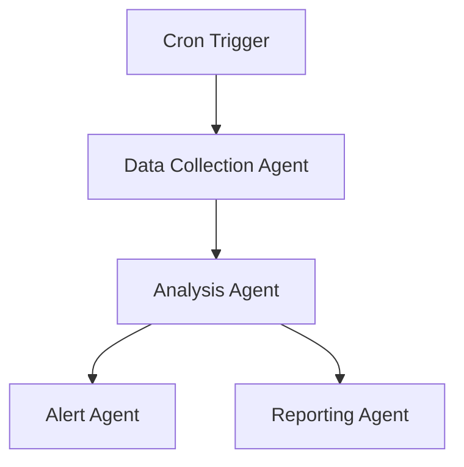

Great! Here's a detailed `README.md` for your **entire agentic AI stock market system**, covering:

1. ✅ **Data Collection Agent**
2. 📈 **Analysis Agent** (Technical + Sentiment + Risk)
3. 🚨 **Alert Agent** (Notifications & thresholds)
4. 📊 **Reporting Agent** (Daily summary & insights)

---

### ✅ Copy-Paste Friendly `README.md`

```markdown
# 📊 Agentic AI Stock Market Analysis System

This project is a modular **multi-agent system** for **stock market monitoring and analysis** using real-time APIs and historical datasets. It consists of four specialized agents:  
- Data Collection Agent  
- Analysis Agent  
- Alert Agent  
- Reporting Agent  

Each agent performs a specific task in the pipeline and can be orchestrated via tools like `n8n`, `asyncio`, or microservices.

---

## 🚀 Overview of Agents

| Agent             | Role                                                        | Tools Used                    |
|------------------|-------------------------------------------------------------|-------------------------------|
| Data Collector    | Gathers stock price data from APIs & static datasets        | n8n, Alpha Vantage, Kaggle    |
| Analysis Agent    | Performs technical, sentiment, and risk analysis            | Python, TA-Lib, Scikit-learn |
| Alert Agent       | Sends alerts based on conditions like RSI, price spikes     | Twilio, SendGrid, Telegram    |
| Reporting Agent   | Creates daily/weekly summary reports with charts & signals  | Matplotlib, Pandas, HTML/PDF  |

---

## 📁 Project Structure

```

.
├── data\_collection/
│   └── n8n\_stock\_collector.json
│   └── historical\_data/\*.csv
├── analysis/
│   └── technical\_analysis.py
│   └── sentiment\_analysis.py
├── alerting/
│   └── alert\_agent.py
│   └── config\_thresholds.json
├── reporting/
│   └── daily\_report\_generator.py
│   └── templates/report\_template.html
├── README.md
└── requirements.txt

```

---

## 🔁 1. Data Collection Agent

### ✅ Tasks
- Collect historical data (from Kaggle)
- Collect real-time data (via Alpha Vantage)
- Run daily using a CRON scheduler in `n8n`

### 🔧 Tools
- `n8n` for workflow automation
- `Alpha Vantage API` for live stock data
- `Kaggle CSVs` for historical data

### 🌐 API Example
```

[https://www.alphavantage.co/query?function=TIME\_SERIES\_DAILY\&symbol=TSLA\&apikey=demo](https://www.alphavantage.co/query?function=TIME_SERIES_DAILY&symbol=TSLA&apikey=demo)

````

---

## 📈 2. Analysis Agent

### ✅ Tasks
- Perform technical indicators (RSI, MACD, Moving Averages)
- Analyze volatility/risk (Sharpe ratio, std deviation)
- Conduct sentiment analysis on latest financial news

### 🔧 Tools
- `TA-Lib` or `Pandas TA` for indicators
- `Scikit-learn` for risk models
- `News API` / `Twitter API` + `TextBlob` / `VADER` for sentiment

### 📊 Sample Technical Analysis
```python
import talib
rsi = talib.RSI(close_prices, timeperiod=14)
macd, _, _ = talib.MACD(close_prices)
````

### 📊 Sample Sentiment Analysis

```python
from vaderSentiment.vaderSentiment import SentimentIntensityAnalyzer
analyzer = SentimentIntensityAnalyzer()
score = analyzer.polarity_scores("Tesla stock surges after earnings!")
```

---

## 🚨 3. Alert Agent

### ✅ Tasks

* Monitor thresholds (RSI < 30 or > 70)
* Detect unusual volume or price spikes
* Send alerts (SMS, Email, Telegram)

### 🔧 Tools

* `Twilio` (SMS)
* `SendGrid` (Email)
* `Telegram Bot API`

### 📋 Example Conditions

* RSI < 30 → "BUY signal"
* Price ↑ 5% in 1hr → Alert

### 📦 Sample Alert Code

```python
if rsi < 30:
    send_sms("TSLA is oversold! RSI = 28")
```

---

## 📊 4. Reporting Agent

### ✅ Tasks

* Generate PDF or HTML reports
* Include price charts, key signals, and trends
* Schedule daily summaries

### 🔧 Tools

* `Matplotlib` / `Plotly` for charts
* `ReportLab` or `HTML + WeasyPrint` for PDF
* `Cron` or `n8n` for automation

### 📈 Sample Report Chart

```python
import matplotlib.pyplot as plt
plt.plot(df['Date'], df['Close'])
plt.title("AAPL Price Trend")
```

---

## 🔄 Workflow Integration (Optional via `n8n` or Async App)



---

## 📌 Dependencies

```bash
pip install pandas yfinance ta yfinance vaderSentiment matplotlib scikit-learn twilio sendgrid
```

---

## 📅 Example Use Case

| Step | Action                                        | Output                            |
| ---- | --------------------------------------------- | --------------------------------- |
| 1    | Run data collection agent (daily 4:30 PM IST) | TSLA daily data collected         |
| 2    | Analysis agent computes RSI, MACD, Sentiment  | RSI=32, MACD crossed, Sentiment + |
| 3    | Alert agent sends BUY signal via SMS          | "TSLA is oversold! RSI = 28"      |
| 4    | Reporting agent generates daily summary PDF   | Email with AAPL & TSLA charts     |

---

## ✍️ Author

**Koorakula Kartheek**
M.Tech - DataScience


